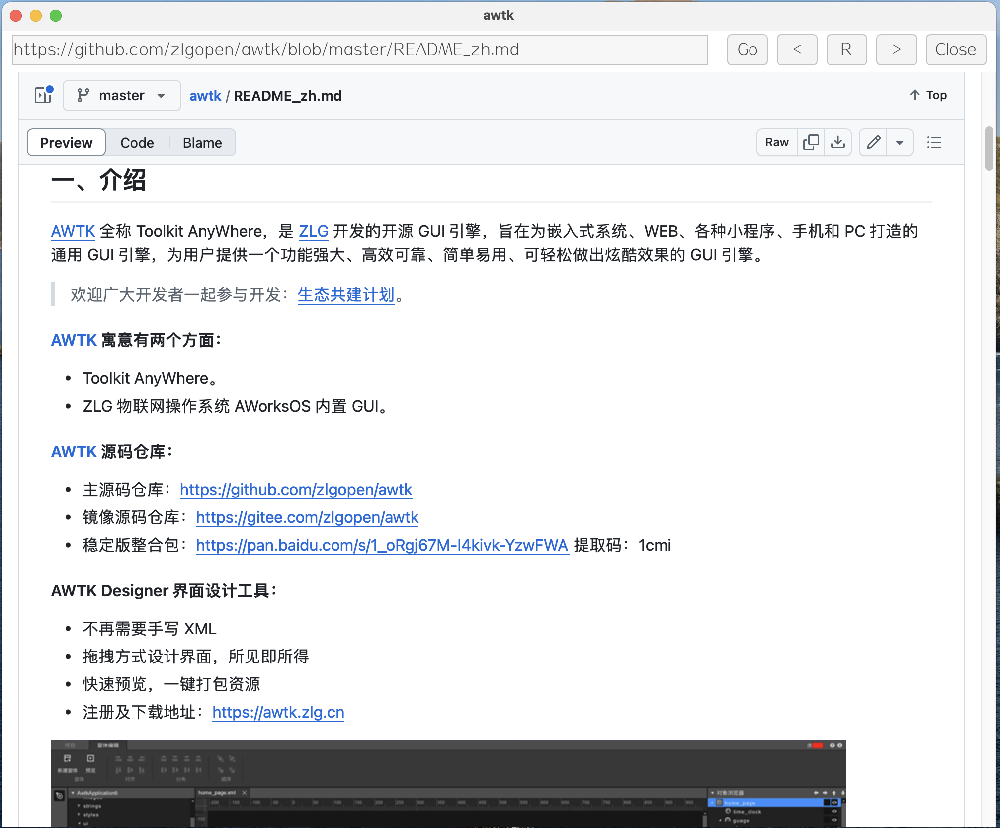

# AWTK-WIDGET-WEB-VIEW 实现笔记 (1) - 难点

[webview](https://github.com/webview/webview) 提供了一个跨平台的 webview 库，其接口简单，提供的例子也直观易懂。但是把它集成到 AWTK 里，还是遇到一些难题，这里记录一下，供有需要的朋友参考。



## 1. 作为 AWTK 控件

webview 提供的例子都是独立的程序，要把它集成到 AWTK 里面，就需要把它封装成一个 AWTK 控件。没有找到参考的例子，只能自己摸索。

所幸 webview\_create 提供了一个参数 window，让我们可以把 webview 嵌入到一个已有的窗口里面，不幸的是，不能指定 webview 在窗口的位置和大小。

webview 始终会占据整个窗口，这就需要将这个窗口，作为子窗口嵌入到主窗口中。技术上是可行的，难点在于不同平台实现方法不同。

```c
/**
 * Creates a new webview instance.
 *
 * @param debug Enable developer tools if supported by the backend.
 * @param window Optional native window handle, i.e. @c GtkWindow pointer
 *        @c NSWindow pointer (Cocoa) or @c HWND (Win32). If non-null,
 *        the webview widget is embedded into the given window, and the
 *        caller is expected to assume responsibility for the window as
 *        well as application lifecycle. If the window handle is null,
 *        a new window is created and both the window and application
 *        lifecycle are managed by the webview instance.
 * @remark Win32: The function also accepts a pointer to @c HWND (Win32) in the
 *         window parameter for backward compatibility.
 * @remark Win32/WebView2: @c CoInitializeEx should be called with
 *         @c COINIT_APARTMENTTHREADED before attempting to call this function
 *         with an existing window. Omitting this step may cause WebView2
 *         initialization to fail.
 * @return @c NULL on failure. Creation can fail for various reasons such
 *         as when required runtime dependencies are missing or when window
 *         creation fails.
 * @retval WEBVIEW_ERROR_MISSING_DEPENDENCY
 *         May be returned if WebView2 is unavailable on Windows.
 */
WEBVIEW_API webview_t webview_create(int debug, void *window);
```

## 2. 两个主循环

webview 有自己的主循环：

```c
/**
 * Runs the main loop until it's terminated.
 *
 * @param w The webview instance.
 */
WEBVIEW_API webview_error_t webview_run(webview_t w);
```

AWTK 也有自己的主循环：

```c
/**
 * @method tk_run
 * 进入 TK 事件主循环。
 * @alias run
 * @annotation ["static", "scriptable"]
 *
 * @return {ret_t} 返回 RET_OK 表示成功，否则表示失败。
 */
ret_t tk_run(void);
```

创建 webview 后，如果运行 webview 的主循环，就不能运行 AWTK 的主循环，反之亦然。

解决思路有几个：

* 1. 两个线程，一个运行 webview 的主循环，一个运行 AWTK 的主循环。事实证明不行，两者都需要在 GUI 线程运行。
* 2. 在 webview 的主循环中，调用 AWTK 的主循环的 main\_loop\_step 函数。webview 提供了 webview\_dispatch 用于注册回调函数，可以在回调函数中调用 AWTK 的 step 函数。但是发现 main\_loop\_step 里读不到窗口的输入事件，可能是 webview 的主循环把所有窗口的输入事件都处理了。

```
/**
 * Schedules a function to be invoked on the thread with the run/event loop.
 * Use this function e.g. to interact with the library or native handles.
 *
 * @param w The webview instance.
 * @param fn The function to be invoked.
 * @param arg An optional argument passed along to the callback function.
 */
WEBVIEW_API webview_error_t webview_dispatch(webview_t w,
                                             void (*fn)(webview_t w, void *arg),
                                             void *arg);
```

* 3. 在 AWTK 的主循环中，调用 webview 的主循环的 step 函数。但是 webview 没有提供这样的函数。
* 4. 只调用  AWTK 的主循环，不管 webview 的主循环。虽然看起来有点不合理，但是实际上，在 Windows 和 MacOS 上 webview 都能正常工作，但是 Linux 上却不行。事后想来也是可以理解的，在 Windows 和 MacOS 上，AWTK 和 webview 都是基于原生窗口的，而 Linux 上，AWTK 基于 X11，webview 基于 GTK，两者的窗口系统不同，可能有冲突。
  
## 3. 打开新窗口的问题

在 Windows 下，将 webview 封装成 AWTK 的控件，并没有遇到太大的问题，但是点击某些链接时，webview 却打开一个新的窗口，这个窗口独立于 AWTK 窗口之外。

观察后发现，是因为这些链接的 target 属性是 _blank，webview 会打开一个新的窗口。

```
<a target="_blank" href="https://mall.jd.com/index-1000377260.html">ZLG 商城</a>
```

解决方法是，hook 所有的点击事件，如果点击的是一个链接，且 target 是 _blank，就阻止默认行为，改为在当前窗口打开。webview 提供 webview_init 函数，可以在创建 webview 时，初始化一些 js 代码，这里就可以用到。

```c
static const char* s_hook_click =
    "window.addEventListener('load', function() {\n"
    "  window.on_url_changed(window.location.href);\n"
    "  const links = document.querySelectorAll('a[target=\"_blank\"]'); \n"
    "  links.forEach(function(link) { \n"
    "    link.addEventListener('click', function(event) { \n"
    "      event.preventDefault(); \n"
    "      window.location.href = link.href; \n"
    "    }); \n"
    "  }); \n"
    "});\n";

    webview_init(w, s_hook_click);
```

后面会介绍不同的平台的实现方法。